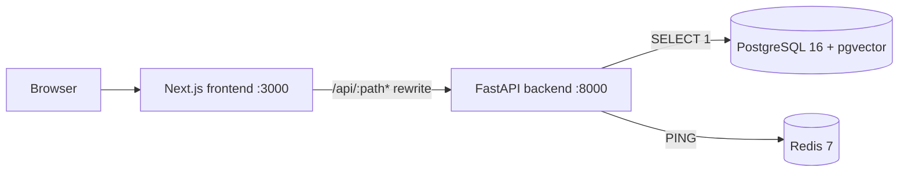

# System Architecture

Kontexa is organized as a monorepo with a Next.js frontend and a FastAPI backend. The backend is
intended to remain a modular monolith: related capabilities live in explicit modules and deploy as
one application until a demonstrated requirement justifies a separate service.

For product requirements, see [PRD.md](PRD.md); for request and data movement, see
[FLOW.md](FLOW.md); for established choices, see [DECISIONS.md](DECISIONS.md).

## Current implementation

- `frontend/` contains an App Router status dashboard. It polls `/api/health` through the Next.js
  rewrite configured in `frontend/next.config.ts`.
- `backend/` exposes `GET /health` and `GET /api/v1/health`. Each returns `200` and `ok` only when
  both PostgreSQL and Redis respond; otherwise it returns `503` and `degraded` without exposing
  connection details.
- `backend/src/kontexa/database/` owns the async SQLAlchemy engine/session and Redis client.
- The repository contains SQLAlchemy models and initial Alembic migration `20260811_0001` for the
  intended application schema. No product API currently reads or writes those entities.
- `infrastructure/docker/docker-compose.yml` runs PostgreSQL, Redis, backend, and frontend for
  local containerized development. The frontend and backend images are production-style builds;
  local hot reload is provided by `make dev` instead.

## Boundaries and principles

- **Frontend boundary:** browser-facing UI communicates with backend routes through explicit HTTP
  responses; the current local API boundary is the Next.js rewrite.
- **API boundary:** FastAPI route handlers validate and present HTTP concerns. Domain behavior
  should not accumulate in handlers.
- **Configuration boundary:** backend settings belong in `kontexa.core.config`; environment values
  are validated by Pydantic Settings.
- **Data boundary:** persistent data access belongs in `kontexa.database`. PostgreSQL is the
  primary relational store and the selected vector store through pgvector.
- **Redis boundary:** Redis is a dependency currently used for readiness verification. Caching,
  sessions, rate limiting, or queues require feature-specific implementation before they can be
  treated as active behavior.
- **Provider boundary:** future AI provider SDKs must sit behind internal domain interfaces so
  provider details do not leak into product logic.

## Planned direction

The roadmap calls for authentication, workspace/project management, conversations, provider-
independent AI, document ingestion and retrieval, integrations, tools, and audit trails. These are
not live architecture components yet. Planned backend domains may be added under
`backend/src/kontexa/` when their implementation begins; current directories must not be inferred
from this plan.

The initial schema anticipates the following concepts: users, workspaces and memberships, projects,
conversations/messages, documents/chunks, memory entries, integrations, tools/agent runs, AI
providers/models/usage, and audit logs. It is a persistence foundation, not evidence that the
corresponding workflows exist.

## Deployment posture

Docker Compose is the supported local orchestration path. The repository does not define a hosted
deployment, Kubernetes configuration, production migration automation, or operational SLOs.
Aiven-specific TLS settings and a bootstrap SQL file are available for a manually provisioned
PostgreSQL service; use Alembic for normal schema evolution.
