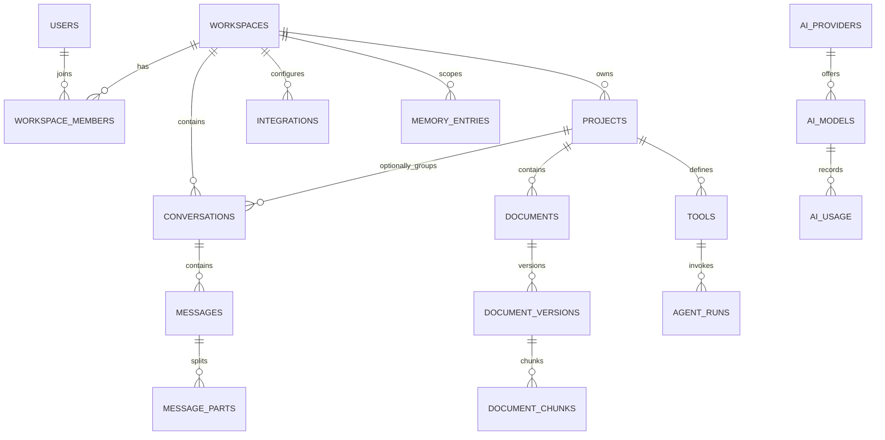

# Database Architecture and Schema

PostgreSQL with pgvector is Kontexa's selected persistent relational and vector store. This
document describes schema artifacts in the repository, not proof that a particular database has
been provisioned or that every modeled capability has a product workflow.

## Sources of truth

- [Alembic migration](../backend/migrations/versions/20260811_0001_initial_schema.py) is the
  application schema source of truth.
- SQLAlchemy models under [`backend/src/kontexa/database/models/`](../backend/src/kontexa/database/models/)
  mirror the application mapping.
- [`infrastructure/database/schema.sql`](../infrastructure/database/schema.sql) is a standalone,
  equivalent bootstrap script for a new empty Aiven service. It is not a migration mechanism.

The Docker Compose database image is `pgvector/pgvector:pg16`. The initial migration enables the
`pgcrypto`, `uuid-ossp`, and `vector` PostgreSQL extensions.

## Current schema artifact

The repository contains one initial migration (`20260811_0001`) and models for the following tables:

| Area | Tables | Current meaning |
| --- | --- | --- |
| Identity and tenancy | `users`, `workspaces`, `workspace_members` | Persistence structure only; no authentication or authorization API exists. |
| Projects and chat | `projects`, `conversations`, `messages`, `message_parts` | Persistence structure only; no project or chat API exists. |
| Knowledge | `documents`, `document_versions`, `document_chunks`, `memory_entries` | Vector-ready schema only; no ingestion, embeddings, search, or memory flow exists. |
| Integrations and tools | `integrations`, `tools`, `agent_runs` | Reserved persistence structure; no integration or tool execution exists. |
| AI metadata | `ai_providers`, `ai_models`, `ai_usage` | Reserved persistence structure; no provider client or usage pipeline exists. |
| Auditing | `audit_logs` | Table exists in the schema; no audit-event producer exists. |

## Relationships and constraints



Most application entities use UUID primary keys generated by `gen_random_uuid()`. The mutable user,
workspace, project, conversation, and integration records carry `created_at`, `updated_at`, and
`deleted_at`; partial indexes support querying non-deleted users, workspaces, projects, and
conversations. `workspace_members` has a composite primary key of `(workspace_id, user_id)`, and
project slugs are unique per workspace.

Foreign-key behavior is defined in the migration: dependent entities generally cascade when their
owner is deleted, while message users, conversation projects, and agent-run tools use `SET NULL`
where preserving the dependent record is intended.

## Vector storage

`document_chunks.embedding` is nullable `VECTOR(1536)` and has the `idx_chunks_embedding` IVFFlat
index using L2 distance with `lists = 100`. This is schema support only: no current application code
creates embeddings or executes vector queries. The dimension is tied to the current model constant;
changing embedding models may require a migration and an explicit decision.

## Current limits and planned controls

The schema includes workspace references on relevant records, but the repository does **not** enable
Row-Level Security, define RLS policies, partition tables, configure backup/PITR, provision a hosted
database, or implement retention jobs. Those are future operational and security decisions, not
active guarantees. Authorization and workspace filtering must be implemented before application
data is exposed.

## Working with the schema

From `backend/`, configure `DATABASE_URL` and apply migrations with:

```bash
uv run alembic upgrade head
```

Do not run the Aiven bootstrap SQL against an existing database. See
[CONFIGURATION.md](CONFIGURATION.md) for connection and TLS settings, and
[DECISIONS.md](DECISIONS.md) for the store decision.
