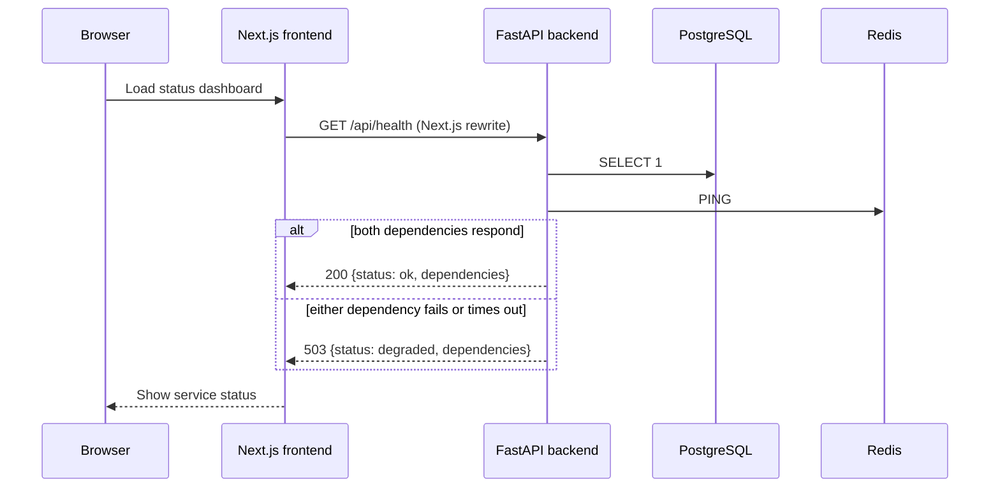
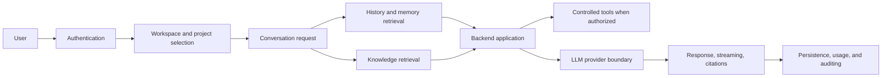

# System and Product Flows

This document separates the flows implemented in the repository from planned product flows. It does
not define future API paths or classes.

## Current readiness flow

The frontend polls every 15 seconds. The rewrite in `frontend/next.config.ts` turns
`/api/health` into `${BACKEND_URL}/health`; it is not a separate Next.js API route. The backend also
exposes the same response at `/api/v1/health`.

## Current error flow

Each dependency probe has the configured timeout. Timeout, network, Redis, and SQLAlchemy errors
produce an `unavailable` dependency result. If any required dependency is unavailable, the health
route returns HTTP 503 with `degraded` status and latency measurements; connection-error details are
logged server-side rather than returned to the client. If the frontend cannot reach or validate the
response, it displays the backend as unreachable.

## Planned product flow

This is planned direction only. The repository has not implemented authentication, conversation
routes, retrieval, providers, streaming, citations, tools, or related persistence behavior.

## Planned feature flows

- **Authentication:** a user proves identity; the backend establishes an authorized session or
  token; requests are checked before workspace data is returned.
- **Workspace/project:** an authorized member selects a workspace and project; the backend verifies
  membership before performing scoped reads or writes.
- **Conversation persistence:** a user message, conversation metadata, and assistant result are
  stored in the modeled conversation/message records after contracts are implemented.
- **Document ingestion and indexing:** selected source material is accepted, versioned, chunked,
  embedded, and written to document tables. Embedding generation and ingestion logic are planned.
- **RAG and memory:** a request is scoped to authorized context, relevant chunks or memory are
  retrieved, and selected context informs a provider request. Citation behavior remains planned.
- **GitHub integration and tools:** a user authorizes a selected integration or tool; the backend
  validates the request, executes within defined controls, and records the result as designed.

## Data ownership and movement

PostgreSQL is the planned persistent system of record for application entities and pgvector
embeddings. The initial schema includes workspace-scoped records and a `VECTOR(1536)` document-chunk
embedding column with an IVFFlat L2 index. Redis is currently only pinged by readiness checks;
caching, sessions, rate limiting, and queues are future uses rather than current data flows.

Future external data (AI providers, GitHub, or other integrations) must cross backend-owned
boundaries. Browser code should not receive provider credentials. See [ARCHITECTURE.md](ARCHITECTURE.md)
and [DATABASE.md](DATABASE.md) for the corresponding boundaries and schema facts.
