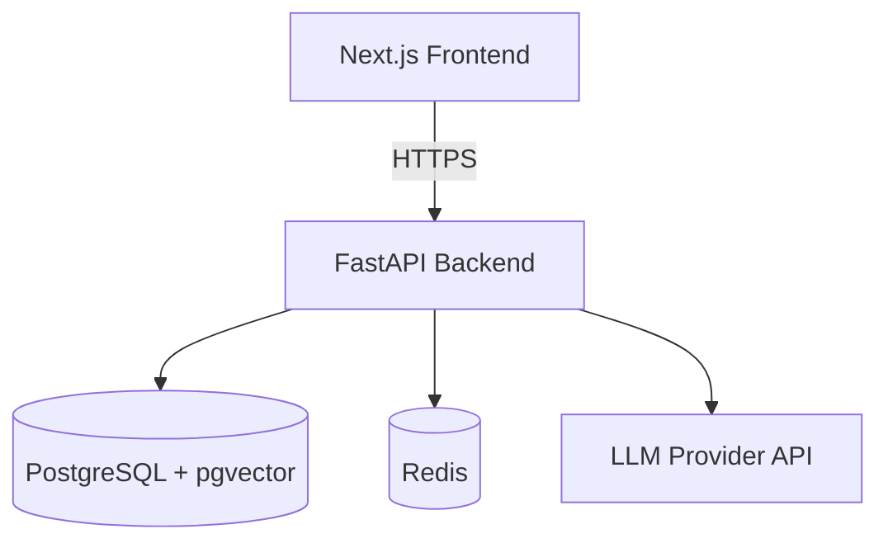
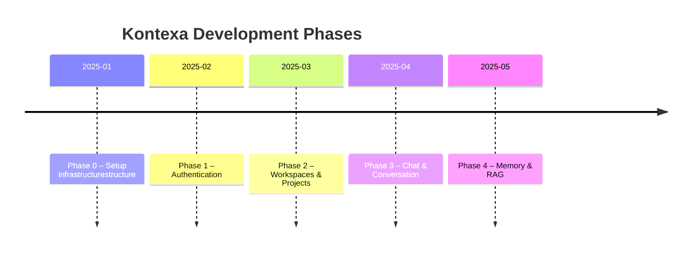
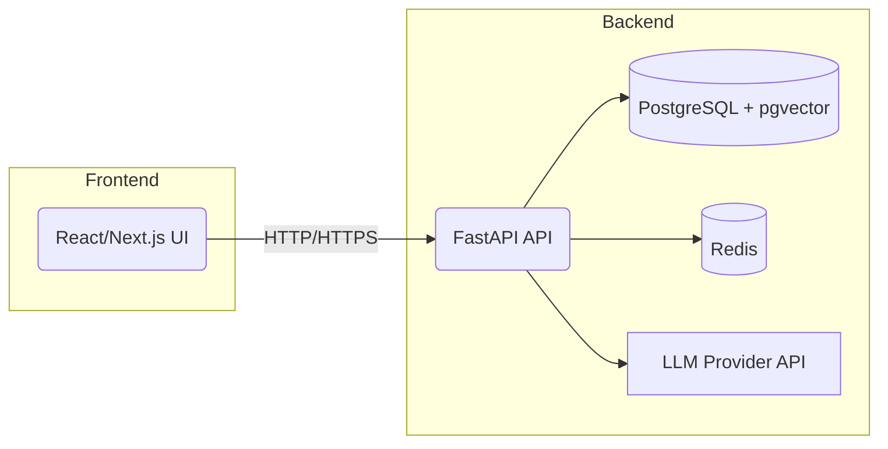
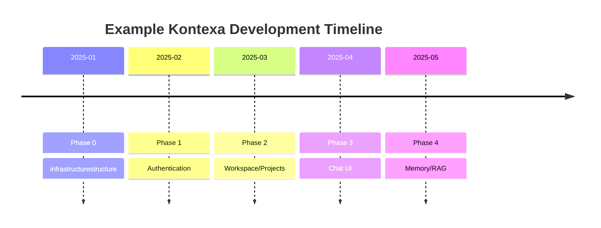

# Executive_Summary.md

Kontexa is envisioned as an **AI-powered development workspace**, combining chat, memory, and knowledge retrieval features within a project-oriented environment. This documentation outlines a **phase-wise implementation plan** to build Kontexa from the ground up. We use a **monorepo** containing a **Next.js** (React/TypeScript) frontend and a **FastAPI** (Python) backend, with PostgreSQL (with pgvector) as the primary database and Redis for caching/session. All services are containerized via Docker Compose for local development. The recommended deployment stack is Vercel for the frontend and a low-cost managed host for the backend (e.g. Render, Railway, or AWS/Azure).

- **Phase 0** – _Foundation_: Set up monorepo structure, install and configure Next.js/TypeScript frontend and FastAPI backend, connect to PostgreSQL and Redis, add Docker Compose, basic health endpoint, lint/format, tests, and CI.
- **Phase 1** – _Authentication_: Implement user signup/login with JWT tokens (using FastAPI’s OAuth2/JWT example), protected APIs, and session management.
- **Phase 2** – _Workspaces & Projects_: Model “workspace” and “project” entities, add APIs and UI for creating/ managing them.
- **Phase 3** – _Chat_: Build conversation and message models and APIs, and create the chat UI. Integrate an LLM endpoint (provider-agnostic) for generating assistant replies.
- **Phase 4** – _Memory & RAG_: Implement embedding-based memory and document storage. Use **pgvector** (a Postgres extension) for vector similarity search. Add components for storing/retrieving past messages and knowledge “documents” (e.g. code files).

Each phase has clear goals and a “done” checklist, with detailed steps (folders/files, CLI commands, code snippets, etc.). CI is implemented via GitHub Actions (using `actions/checkout`, `setup-python`, `setup-node`, running lint/tests). Sample configuration files (`.env.example`, `docker-compose.yml`, `pyproject.toml`, `package.json`, Makefile) are provided. Mermaid diagrams illustrate the architecture and timeline. Agent-friendly task definitions (JSON) are included for all actions.



The table below compares some cloud options; **we recommend PostgreSQL + pgvector and simple managed services** for early stages:

| Component            | Options (Free/Tier)                                                                                                    | Recommendation                                                       |
| -------------------- | ---------------------------------------------------------------------------------------------------------------------- | -------------------------------------------------------------------- |
| **Frontend Hosting** | Vercel (Next.js native, free tier); Netlify (supports Next.js)                                                         | **Vercel** for easy Next.js deployment                               |
| **Backend Hosting**  | Railway (free credit, ~$5/mo tier); Render (free $7 tier); Heroku (no free since 2022); AWS/GCP/Azure (free tier 12mo) | Use **Railway/Render** for managed simplicity                        |
| **Postgres DB**      | Railway Postgres (free tier), Render DB, Supabase (free tier ~500MB), ElephantSQL (20MB free)                          | **Railway Postgres** or **Supabase** for quick setup (with pgvector) |
| **Vector Store**     | pgvector (extension on Postgres); Qdrant (external DB); Pinecone (paid SaaS)                                           | **pgvector** (no extra service needed)                               |
| **Cache / Session**  | Redis (Docker container / managed)                                                                                     | **Redis** for session store and ephemeral cache                      |
| **CI/CD**            | GitHub Actions (free for open source); Travis, CircleCI                                                                | **GitHub Actions** (first-party, easy, free)                         |

This plan follows best practices and official guidelines: e.g., **create-next-app** for scaffolding Next.js, FastAPI’s quickstart for REST APIs, Docker Compose for multi-service setup, and Alembic for database migrations. The result is a _production-ready foundation_, upon which to iterate additional features (memory, tools, etc.).

# Phase_0_Setup.md

**Phase 0: infrastructurestructure & Foundation** – _Goal:_ Establish the project structure, basic services, and toolchain. Build a “hello world” stack with Next.js frontend and FastAPI backend connected to PostgreSQL and Redis.

**Definition of Done:**

- ✅ Monorepo with `/backend` and `/frontend` directories.
- ✅ Backend can start (e.g. `uvicorn main:app`).
- ✅ Frontend can start (`npm run dev`).
- ✅ PostgreSQL and Redis services running (e.g. via Docker).
- ✅ Backend can connect to Postgres and Redis (test connection).
- ✅ A `/health` endpoint returns status {"status":"ok"}.
- ✅ Frontend fetches from the `/health` API and displays result.
- ✅ Linting/formatting configured (e.g. Ruff, Prettier).
- ✅ Tests setup (pytest for backend, Jest/React Testing Library for frontend).
- ✅ GitHub Actions CI runs lint and tests on push.
- ✅ Documentation (README with setup instructions).

## Step-by-Step Implementation

1. **Create Monorepo Structure.**  
   From the project root, run:
   ```bash
   mkdir -p /backend /frontend infrastructure/docker docs
   echo "# Kontexa" > README.md
   ```
   The structure should be:
   ```
   Kontexa/
   ├ backend/       # FastAPI app
   ├ frontend/      # Next.js app
   ├ docs/
   ├ infrastructure/
   │   └ docker/        # Dockerfiles, scripts
   ├ .github/           # GitHub workflows
   ├ docker-compose.yml
   ├ .env.example
   ├ README.md
   ```
2. **Initialize Backend (FastAPI).**
   - Enter `/backend/`.
   - Use Poetry or pipenv to manage Python dependencies (example uses Poetry):
     ```bash
     cd /backend
     poetry init -n
     poetry add fastapi uvicorn sqlalchemy psycopg[binary] alembic pydantic
     ```
     (Also add `python-dotenv` for env vars, and any testing libs like `pytest`.)
   - Create `main.py` with a basic FastAPI app and health endpoint:
     ```python
     # /backend/src/kontexa/main.py
     from fastapi import FastAPI
     app = FastAPI()
     @app.get("/health")
     async def health():
         return {"status": "ok"}
     ```
     This follows the FastAPI quickstart example.
   - Verify: `uvicorn main:app --reload` should serve at http://localhost:8000 (see Swagger UI).
3. **Initialize Frontend (Next.js).**
   - Open a new terminal in `apps/frontend/`.
   - Run Next.js init (TypeScript & Tailwind):
     ```bash
     cd /frontend
     npx create-next-app@latest . --typescript --eslint --tailwind
     ```
     This uses Next’s official CLI.
   - Optionally install [shadcn/ui](https://ui.shadcn.com) for prebuilt UI components.
   - Create a simple page that calls `/api/health` or `/api/proxy-health`. (We’ll set up API proxy next.)
4. **Configure PostgreSQL and Redis.**
   - In the project root, create `docker-compose.yml` (if not in infrastructure folder):
     ```yaml
     version: "3.9"
     services:
       db:
         image: postgres:15
         environment:
           POSTGRES_USER: rada
           POSTGRES_PASSWORD: rada
           POSTGRES_DB: Kontexa
         volumes:
           - db_data:/var/lib/postgresql/data
         ports:
           - "5432:5432"
       redis:
         image: redis:7
         ports:
           - "6379:6379"
       backend:
         build: ./apps/backend
         command: uvicorn main:app --host 0.0.0.0 --port 8000
         volumes:
           - ./apps/backend:/app
         ports:
           - "8000:8000"
         env_file: .env
         depends_on:
           - db
           - redis
       frontend:
         build: ./apps/frontend
         command: npm run dev
         volumes:
           - ./apps/frontend:/app
         ports:
           - "3000:3000"
         env_file: .env
         depends_on:
           - backend
     volumes:
       db_data:
     ```
     This defines **services** per Docker Compose (official docs example).
   - Create `infrastructure/docker/Dockerfile` for backend:
     ```dockerfile
     # apps/backend/Dockerfile
     FROM python:3.11-slim
     WORKDIR /app
     COPY pyproject.toml poetry.lock* /app/
     RUN pip install poetry && poetry config virtualenvs.create false && poetry install --no-dev
     COPY . /app
     CMD ["uvicorn", "main:app", "--host", "0.0.0.0", "--port", "8000"]
     ```
     For frontend, you can use Node 18 image or rely on binding to host Node (skip if local).
5. **Environment Configuration.**
   - Create a `.env.example` in root with placeholders:
     ```dotenv
     DATABASE_URL=postgresql://rada:rada@db:5432/Kontexa
     REDIS_URL=redis://redis:6379
     SECRET_KEY=changeme123
     ```
   - Backend should load these (e.g. via `python-dotenv` in code or as FastAPI settings).
   - Frontend `.env.local` can have `NEXT_PUBLIC_API_BASE=http://localhost:8000`.
6. **Basic Backend–Database Connection.**
   - In `apps/backend`, use SQLAlchemy to connect:
     ```python
     from sqlalchemy import create_engine
     from sqlalchemy.orm import sessionmaker
     from sqlalchemy.ext.declarative import declarative_base
     import os
     SQLALCHEMY_DATABASE_URL = os.getenv("DATABASE_URL")
     engine = create_engine(SQLALCHEMY_DATABASE_URL, pool_pre_ping=True)
     SessionLocal = sessionmaker(bind=engine, expire_on_commit=False)
     Base = declarative_base()
     ```
     No models yet, but ensure engine connects.
   - Run `docker compose up` to start containers. In another shell, test DB:
     ```bash
     docker exec -it $(docker ps -qf "name=db") psql -U rada -d Kontexa -c '\l'
     ```
7. **Create Alembic Migration Setup.**
   - In `apps/backend`, initialize Alembic:
     ```bash
     cd apps/backend
     alembic init alembic
     ```
     This creates an `alembic/` folder with `env.py`, etc.
   - Configure `alembic.ini` to use `DATABASE_URL` or config in `env.py`.
   - Create first dummy migration:
     ```bash
     alembic revision -m "create users table" --autogenerate
     alembic upgrade head
     ```
     (Later we’ll add models, then auto-generate.)
8. **Frontend ↔ Backend Proxy (Optional).**
   - To avoid CORS, configure Next.js to proxy `/api/health` to backend. In `next.config.js`:
     ```js
     module.exports = {
       async rewrites() {
         return [
           {
             source: "/api/:path*",
             destination: "http://localhost:8000/:path*",
           },
         ];
       },
     };
     ```
   - Now in frontend code (e.g., `pages/index.tsx`), fetch `/api/health` and display status.

9. **Health Endpoint.**
   - Backend `GET /health` already returns `{"status":"ok"}`.
   - Frontend calls it (with `fetch`) and shows the status. Confirm via browser or `curl http://localhost:8000/health`.

10. **Linting and Formatting.**
    - **Backend:** use [Ruff](https://github.com/astral-sh/ruff) as linter/formatter. Add to `pyproject.toml`:
      ```toml
      [tool.ruff]
      select = ["E", "F", "W", "C", "N", "Q"]
      extend_ignore = ["D104"]
      ```
    - **Frontend:** Next.js already includes ESLint (`npm run lint`) and can use Prettier.
    - **Pre-commit Hooks:** (optional) Add `.pre-commit-config.yaml` to run linters/formats on commit (using `ruff` and `eslint`).
11. **Testing Setup.**
    - **Backend:** create `tests/` folder. Add a simple pytest (e.g., test health endpoint using `TestClient`).
    - **Frontend:** use Jest or React Testing Library (Next apps come with basic setup; `npm install jest` if needed). Write one trivial test (e.g., homepage renders).
12. **GitHub Actions (CI).**
    - In `.github/workflows/ci.yml`, set up actions for both backend and frontend. Example snippet:
      ```yaml
      name: CI
      on: [push, pull_request]
      jobs:
        backend:
          runs-on: ubuntu-latest
          steps:
            - uses: actions/checkout@v3
            - name: Setup Python
              uses: actions/setup-python@v4
              with: python-version: '3.x'
            - run: pip install poetry && poetry install
            - run: poetry run ruff check .
            - run: poetry run pytest -q
        frontend:
          runs-on: ubuntu-latest
          steps:
            - uses: actions/checkout@v3
            - name: Setup Node.js
              uses: actions/setup-node@v4
              with: node-version: '18'
            - run: npm install
            - run: npm run lint
            - run: npm test
      ```
      This follows GitHub’s Python CI example (using `actions/setup-python`).
13. **Deployment Notes.**
    - Locally: use `docker compose up` to run all services.
    - **Roll-forward/Rollback:** If deploying via Docker image tags or Kubernetes later, use versioned images. For now, ensure migrations are repeatable (`alembic downgrade head`). Backup PostgreSQL data if seeding large test data.
    - On first deploy to cloud: set environment variables (`DATABASE_URL`, `REDIS_URL`, `SECRET_KEY`) via platform. Use managed Postgres and Redis. Deploy frontend to Vercel (just push to GitHub, it auto-deploys).
14. **Documentation.**
    - Populate `README.md` with steps to run locally (Docker, env vars), and links to each component’s docs.
    - Include a `.env.example` file for developers to copy.

## Sample Files

- **.env.example**
  ```dotenv
  DATABASE_URL=postgresql://rada:rada@db:5432/Kontexa
  REDIS_URL=redis://redis:6379
  SECRET_KEY=CHANGE_ME_SECRET
  ```
- **docker-compose.yml** (root): _[See step 4 above.]_
- **Makefile** (root):
  ```makefile
  up:
    docker compose up -d
  down:
    docker compose down
  logs:
    docker compose logs -f
  ```
- **pyproject.toml** (backend): include FastAPI, SQLAlchemy, Alembic, pytest, ruff.
- **package.json scripts** (frontend):
  ```json
  {
    "scripts": {
      "dev": "next dev",
      "build": "next build",
      "start": "next start",
      "lint": "next lint"
    }
  }
  ```
- **Example Alembic env.py**: Ensure it uses `DATABASE_URL` from env and SQLAlchemy `Base.metadata`.

```python
# /backend/alembic/env.py (excerpt)
from sqlalchemy import engine_from_config
from app.models import Base  # import your models Base
from app.database import SQLALCHEMY_DATABASE_URL

config.set_main_option('sqlalchemy.url', SQLALCHEMY_DATABASE_URL)
target_metadata = Base.metadata
```

# tasks_phase0.json

```json
[
  {
    "id": "phase0-setup-monorepo",
    "description": "Create monorepo structure with folders apps/backend, apps/frontend, infrastructure/docker, docs.",
    "inputs": "Project root",
    "outputs": "Directory structure initialized",
    "preconditions": "None",
    "estimated_time": "15m",
    "priority": "High"
  },
  {
    "id": "phase0-backend-init",
    "description": "Initialize FastAPI backend: create Python environment, install FastAPI, uvicorn, SQLAlchemy, Alembic, etc.",
    "inputs": "apps/backend directory",
    "outputs": "FastAPI skeleton with main.py and basic /health endpoint",
    "preconditions": "Monorepo created",
    "estimated_time": "30m",
    "priority": "High"
  },
  {
    "id": "phase0-frontend-init",
    "description": "Initialize Next.js frontend with TypeScript and Tailwind (`create-next-app`).",
    "inputs": "apps/frontend directory",
    "outputs": "Next.js project scaffolded",
    "preconditions": "Monorepo created",
    "estimated_time": "30m",
    "priority": "High"
  },
  {
    "id": "phase0-docker-compose",
    "description": "Create docker-compose.yml for backend (FastAPI), frontend (Next.js), PostgreSQL, and Redis.",
    "inputs": "Monorepo structure, service Dockerfiles",
    "outputs": "docker-compose.yml in project root",
    "preconditions": "Backend and frontend directories exist",
    "estimated_time": "20m",
    "priority": "High"
  },
  {
    "id": "phase0-env-file",
    "description": "Create .env.example with placeholders for DATABASE_URL, REDIS_URL, SECRET_KEY.",
    "inputs": "Project root",
    "outputs": ".env.example file",
    "preconditions": "docker-compose written",
    "estimated_time": "10m",
    "priority": "Medium"
  },
  {
    "id": "phase0-backend-db-connection",
    "description": "Configure FastAPI to connect to PostgreSQL and Redis using SQLAlchemy.",
    "inputs": "Database URL from .env, SQLAlchemy code",
    "outputs": "Backend able to connect to db and redis",
    "preconditions": "Containers running via docker-compose up",
    "estimated_time": "30m",
    "priority": "High"
  },
  {
    "id": "phase0-alembic-init",
    "description": "Run `alembic init` to create migration environment and perform first dummy migration.",
    "inputs": "Apps/backend code",
    "outputs": "alembic/ directory with templates, alembic.ini configured",
    "preconditions": "Database connection working",
    "estimated_time": "20m",
    "priority": "Medium"
  },
  {
    "id": "phase0-frontend-health",
    "description": "Implement frontend code to fetch /api/health from backend and display status.",
    "inputs": "Next.js API route or proxy setup, frontend page",
    "outputs": "Frontend showing health check message",
    "preconditions": "Backend /health works",
    "estimated_time": "20m",
    "priority": "Medium"
  },
  {
    "id": "phase0-linting-format",
    "description": "Configure code linters/formatters: Ruff for Python, ESLint/Prettier for React.",
    "inputs": "Apps/backend and frontend code",
    "outputs": "Lint config files and passing lint checks",
    "preconditions": "Project scaffolded",
    "estimated_time": "30m",
    "priority": "Low"
  },
  {
    "id": "phase0-tests-setup",
    "description": "Set up testing: pytest in backend, Jest/RTL in frontend. Write simple tests (e.g., health endpoint).",
    "inputs": "Existing code",
    "outputs": "tests/ directories with basic tests, passing CI",
    "preconditions": "Basic features implemented",
    "estimated_time": "45m",
    "priority": "Medium"
  },
  {
    "id": "phase0-github-actions",
    "description": "Add GitHub Actions workflow (CI) for backend (lint + pytest) and frontend (lint + tests).",
    "inputs": ".github/workflows directory",
    "outputs": "ci.yml with jobs for Python and Node.js",
    "preconditions": "Tests exist",
    "estimated_time": "30m",
    "priority": "High"
  }
]
```

# Phase_1_Authentication.md

**Phase 1: Authentication** – _Goal:_ Add user accounts, secure endpoints, and login/session management. The frontend should allow signup/login and store a session token.

**Definition of Done:**

- [ ] Database table/model for users (with password hash).
- [ ] FastAPI endpoints: `POST /signup`, `POST /login` (returns JWT token), `GET /api/me` (protected).
- [ ] Use OAuth2 Password Flow with JWT tokens (FastAPI example).
- [ ] FastAPI dependencies to retrieve `current_user` from token.
- [ ] Frontend pages for login and signup (forms).
- [ ] Store JWT (e.g. HTTP-only cookie or in local storage) and send `Authorization: Bearer` for requests.
- [ ] Protected API calls require valid token (e.g. `/api/me` returns user info).
- [ ] Tests for auth endpoints (e.g. login and token).

## Detailed Steps

1. **Database – Users Table.**
   - In SQLAlchemy models (`/backend/models.py`), define `User`:
     ```python
     class User(Base):
         __tablename__ = "users"
         id = Column(Integer, primary_key=True)
         email = Column(String, unique=True, index=True, nullable=False)
         name = Column(String, nullable=True)
         hashed_password = Column(String, nullable=False)
         created_at = Column(DateTime, default=datetime.utcnow)
     ```
   - Run Alembic autogeneration:
     ```bash
     alembic revision -m "create users table" --autogenerate
     alembic upgrade head
     ```
2. **Password Hashing.**
   - Use `passlib[bcrypt]` (install via Poetry) to hash passwords.
   - Add `from passlib.context import CryptContext` in backend code, and create `pwd_context = CryptContext(schemes=["bcrypt"], deprecated="auto")`.
3. **Signup Endpoint.**
   - `POST /signup`: accept JSON {email, name, password}, hash the password, create `User` in DB. Return user info (minus password).
   - Example snippet:
     ```python
     @app.post("/signup")
     async def signup(data: UserCreate):
         db = SessionLocal()
         user = User(
             email=data.email, name=data.name,
             hashed_password=pwd_context.hash(data.password)
         )
         db.add(user)
         db.commit()
         db.refresh(user)
         return {"id": user.id, "email": user.email, "name": user.name}
     ```
4. **Login Endpoint.**
   - Implement FastAPI’s OAuth2 password flow: use `OAuth2PasswordRequestForm` and create JWT as in example.
   - Example:
     ```python
     from fastapi.security import OAuth2PasswordRequestForm
     @app.post("/login")
     async def login(form_data: OAuth2PasswordRequestForm = Depends()):
         user = authenticate_user(db, form_data.username, form_data.password)
         if not user:
             raise HTTPException(401, "Invalid credentials")
         access_token = create_access_token({"sub": user.email})
         return {"access_token": access_token, "token_type": "bearer"}
     ```
   - Use `jwt.encode()` with a `SECRET_KEY` and expiry. (FastAPI docs provide a full example.)
5. **Protected Endpoint (`/me`).**
   - Use dependency to get `current_user` from token (as in FastAPI example):
     ```python
     @app.get("/api/me")
     async def read_me(current_user: User = Depends(get_current_active_user)):
         return {"email": current_user.email, "name": current_user.name}
     ```
6. **Frontend – Auth Pages.**
   - Create Next.js pages (`pages/login.tsx`, `pages/signup.tsx`) with forms.
   - On submit, `POST` to backend (`/api/login` and `/api/signup`). On successful login, store the JWT (e.g. in `document.cookie` or `localStorage`).
   - Set an HTTP-only cookie with `Access` and/or `Refresh` tokens if preferred (requires API route handling cookies).
   - After login, redirect to a protected page (e.g. workspace list).
7. **API Proxy/Auth Headers.**
   - Ensure frontend includes `Authorization: Bearer <token>` on API fetches after login. You may use `fetch()` with headers.
   - Alternatively, set a cookie via `/login` response and Next.js `credentials: 'include'`.
8. **Testing Auth.**
   - Write pytest tests for signup and login (e.g. using `TestClient`). Confirm protected endpoint rejects without token and succeeds with valid token.
   - (Use FastAPI’s `TestClient` from `starlette.testclient`).
9. **Definition-of-Done Checklist:**
   - [ ] Backend /signup and /login working (tested with curl or Postman).
   - [ ] JWT tokens issued and validated (token contains user email).
   - [ ] `Authorization: Bearer` protects `/api/me`.
   - [ ] Frontend login/signup forms exist and navigate to private pages.
   - [ ] Session management (token stored or cookie set).
   - [ ] Update documentation (README for auth endpoints).



# tasks_phase1.json

```json
[
  {
    "id": "phase1-create-user-model",
    "description": "Add User model (SQLAlchemy) and run initial migration to create users table.",
    "inputs": "Database schema",
    "outputs": "User table in PostgreSQL",
    "preconditions": "Phase0 completed, DB running",
    "estimated_time": "30m",
    "priority": "High"
  },
  {
    "id": "phase1-implement-signup",
    "description": "Implement POST /signup endpoint (hash password and store user).",
    "inputs": "User data (email, password)",
    "outputs": "New user record, HTTP response",
    "preconditions": "User model exists",
    "estimated_time": "30m",
    "priority": "High"
  },
  {
    "id": "phase1-implement-login",
    "description": "Implement POST /login using FastAPI OAuth2 & JWT (create_access_token).",
    "inputs": "Username/password via form",
    "outputs": "JWT access token",
    "preconditions": "Password hashing setup",
    "estimated_time": "45m",
    "priority": "High"
  },
  {
    "id": "phase1-protect-endpoints",
    "description": "Add dependency get_current_user() to protect /api/me and other endpoints.",
    "inputs": "JWT token in Authorization header",
    "outputs": "User object or 401 error",
    "preconditions": "Login returns valid JWT",
    "estimated_time": "20m",
    "priority": "High"
  },
  {
    "id": "phase1-frontend-forms",
    "description": "Create Next.js pages /signup and /login with forms posting to backend.",
    "inputs": "Empty signup/login pages",
    "outputs": "Forms that send fetch requests to API",
    "preconditions": "Auth endpoints implemented",
    "estimated_time": "30m",
    "priority": "Medium"
  },
  {
    "id": "phase1-session-management",
    "description": "Store JWT on login (e.g., cookie or localStorage) and attach to future API requests.",
    "inputs": "Login API response",
    "outputs": "Bearer token sent on protected requests",
    "preconditions": "Login works",
    "estimated_time": "20m",
    "priority": "Medium"
  },
  {
    "id": "phase1-backend-tests",
    "description": "Write pytest tests for signup, login, and protected /api/me.",
    "inputs": "Test client",
    "outputs": "Automated tests passing",
    "preconditions": "Auth API implemented",
    "estimated_time": "45m",
    "priority": "Medium"
  }
]
```

# Phase_2_Workspaces.md

**Phase 2: Workspaces & Projects** – _Goal:_ Model user workspaces and projects within them. This allows organizing conversations and memory by project context.

**Definition of Done:**

- [ ] Database models: `Workspace` (id, name, owner), `WorkspaceMember`, `Project` (name, workspace_id, description).
- [ ] Relations: User 1–_ Workspace (owner), Workspace _–_ User via membership, Workspace 1–_ Project.
- [ ] FastAPI endpoints: create/list/update workspaces and projects (CRUD).
- [ ] UI: Page listing user’s workspaces; within a workspace, list/create projects.
- [ ] Permissions: Only workspace members can see/edit that workspace.
- [ ] Tests: CRUD operations for workspaces/projects.

## Steps

1. **Data Models.**
   - In `models.py`, add:

     ```python
     class Workspace(Base):
         __tablename__ = "workspaces"
         id = Column(Integer, primary_key=True)
         owner_id = Column(Integer, ForeignKey("users.id"))
         name = Column(String, nullable=False)
         created_at = Column(DateTime, default=datetime.utcnow)
         # relationship: members, projects

     class WorkspaceMember(Base):
         __tablename__ = "workspace_members"
         id = Column(Integer, primary_key=True)
         workspace_id = Column(Integer, ForeignKey("workspaces.id"))
         user_id = Column(Integer, ForeignKey("users.id"))
         role = Column(String, default="member")
         joined_at = Column(DateTime, default=datetime.utcnow)
         # e.g. roles: Owner, Admin, Member, Viewer

     class Project(Base):
         __tablename__ = "projects"
         id = Column(Integer, primary_key=True)
         workspace_id = Column(Integer, ForeignKey("workspaces.id"))
         name = Column(String, nullable=False)
         description = Column(Text, nullable=True)
         created_at = Column(DateTime, default=datetime.utcnow)
     ```

   - Run Alembic migration (revision & upgrade).

2. **API Endpoints.**
   - **Workspaces:**
     - `POST /workspaces` – create new workspace (owner = current_user).
     - `GET /workspaces` – list workspaces the user owns or is a member of.
     - `GET /workspaces/{id}` – details (if member).
     - `PUT /workspaces/{id}` – rename (owner/admin only).
     - `DELETE /workspaces/{id}` – remove workspace (owner only).
   - **Projects:**
     - `POST /workspaces/{wid}/projects` – create project in workspace.
     - `GET /workspaces/{wid}/projects` – list projects.
     - `GET/PUT/DELETE /workspaces/{wid}/projects/{pid}` – project CRUD.
   - Use FastAPI’s path parameters and dependencies for workspace context.
3. **Permissions & Membership.**
   - On workspace creation, also create a `WorkspaceMember` for the owner.
   - Endpoints should check `current_user` is a member of the workspace (or owner) before returning data or allowing changes.
   - For simplicity, initial roles: the creator is `OWNER`. Others can be added later via another endpoint (not in Phase 2).
4. **Frontend UI.**
   - Add a “Workspace Dashboard” page listing existing workspaces (fetched via API).
   - Within each workspace page, show its name and a list of projects. Include a form to create a new project.
   - Links: e.g., `/workspaces/[id]` and `/workspaces/[id]/projects/[pid]`.
5. **Testing.**
   - Pytest tests for workspace/project CRUD (using TestClient).
   - Example: create workspace, ensure owner is correct; user cannot access others’ workspace.
6. **Done Checklist:**
   - [ ] Tables and migrations for workspaces, memberships, projects.
   - [ ] APIs work end-to-end (test with Postman or frontend).
   - [ ] Frontend pages for creating/listing workspaces/projects.
   - [ ] Access control enforced.

# tasks_phase2.json

```json
[
  {
    "id": "phase2-create-workspace-models",
    "description": "Add SQLAlchemy models for Workspace, WorkspaceMember, and Project. Run migration.",
    "inputs": "Apps/backend/models.py",
    "outputs": "Database tables: workspaces, workspace_members, projects",
    "preconditions": "Phase1 completed",
    "estimated_time": "30m",
    "priority": "High"
  },
  {
    "id": "phase2-workspace-endpoints",
    "description": "Implement FastAPI endpoints for creating and listing workspaces (CRUD).",
    "inputs": "Workspace models",
    "outputs": "API endpoints /workspaces",
    "preconditions": "Database tables exist",
    "estimated_time": "45m",
    "priority": "High"
  },
  {
    "id": "phase2-project-endpoints",
    "description": "Implement FastAPI endpoints for projects within a workspace (/workspaces/{id}/projects).",
    "inputs": "Project model",
    "outputs": "API endpoints /projects",
    "preconditions": "Workspace endpoints implemented",
    "estimated_time": "45m",
    "priority": "Medium"
  },
  {
    "id": "phase2-permissions",
    "description": "Add permission checks: only workspace members (or owner) can access/modify a workspace.",
    "inputs": "Auth system, workspace membership",
    "outputs": "Protected endpoints returning 401/403 appropriately",
    "preconditions": "Auth and membership model ready",
    "estimated_time": "30m",
    "priority": "High"
  },
  {
    "id": "phase2-frontend-workspaces",
    "description": "Create a Next.js page to display user’s workspaces and a form to create one.",
    "inputs": "Workspace APIs",
    "outputs": "Workspace list UI with create form",
    "preconditions": "Workspace API working",
    "estimated_time": "30m",
    "priority": "Medium"
  },
  {
    "id": "phase2-frontend-projects",
    "description": "Within a workspace page, list its projects and add a form to create a new project.",
    "inputs": "Project APIs, workspace UI",
    "outputs": "Project list UI with create form",
    "preconditions": "Workspace UI page exists",
    "estimated_time": "30m",
    "priority": "Medium"
  },
  {
    "id": "phase2-tests",
    "description": "Write tests for workspace/project APIs (create/list/update/delete).",
    "inputs": "TestClient",
    "outputs": "Passing pytest for workspace/project logic",
    "preconditions": "Endpoints implemented",
    "estimated_time": "30m",
    "priority": "Low"
  }
]
```

# Phase_3_Chat.md

**Phase 3: Chat & Conversation** – _Goal:_ Implement chat conversations and integrate a language model backend. Build the messaging structure and UI for users to chat within a project context.

**Definition of Done:**

- [ ] Database models: `Conversation` (id, project_id, title), `Message` (id, conversation_id, role, content, timestamp).
- [ ] APIs:
  - `POST /workspaces/{wid}/projects/{pid}/conversations` (create conversation)
  - `GET /.../conversations` (list)
  - `POST /.../conversations/{cid}/messages` (add message)
  - `GET /.../conversations/{cid}/messages` (list messages)
- [ ] Frontend: Chat UI (e.g. text input, message history) under each project.
- [ ] On sending a user message, append to DB and forward the conversation (so far) to the LLM API; stream or return the assistant’s response and save it as a new message (role=assistant).
- [ ] Ensure conversation context is maintained (include last N messages as context).
- [ ] Tests: message flow logic.

## Steps

1. **Data Models – Chat.**

   ```python
   class Conversation(Base):
       __tablename__ = "conversations"
       id = Column(Integer, primary_key=True)
       project_id = Column(Integer, ForeignKey("projects.id"))
       title = Column(String, default="New Conversation")
       created_at = Column(DateTime, default=datetime.utcnow)

   class Message(Base):
       __tablename__ = "messages"
       id = Column(Integer, primary_key=True)
       conversation_id = Column(Integer, ForeignKey("conversations.id"))
       role = Column(String)   # 'user', 'assistant', or 'system'
       content = Column(Text)
       timestamp = Column(DateTime, default=datetime.utcnow)
   ```

   Migrate these (Alembic revision + upgrade).

2. **APIs – Conversations & Messages.**
   - Create conversation: `POST /api/workspaces/{wid}/projects/{pid}/conversations`. Set `project_id` from URL, return `conv.id`.
   - Add message: `POST /api/conversations/{cid}/messages`. Payload `{ "role": "...", "content": "..." }`. Save to DB.
   - Get messages: `GET /api/conversations/{cid}/messages` returns all messages for that conversation (ordered by time).
   - (Optionally: GET/PUT conversation meta like title.)
3. **LLM Integration.**
   - After saving a user message (`role="user"`), call the LLM provider (e.g. OpenAI) with the conversation history. For example, use the OpenAI API or an abstraction.
   - If streaming, send back chunks; otherwise wait for full response. Save the assistant’s message (`role="assistant"`) in DB.
   - **Example:**
     ```python
     from openai import OpenAI
     @app.post("/api/conversations/{cid}/messages")
     async def add_message(cid: int, msg: MessageCreate):
         db = SessionLocal()
         conversation = db.query(Conversation).filter(Conversation.id == cid).first()
         # append user message to DB
         user_msg = Message(conversation_id=cid, role="user", content=msg.content)
         db.add(user_msg); db.commit()
         db.refresh(user_msg)
         # call LLM with history
         messages = db.query(Message).filter(Message.conversation_id==cid).all()
         prompt = [{"role": m.role, "content": m.content} for m in messages]
         assistant_reply = await call_llm_api(prompt)
         # save assistant message
         ai_msg = Message(conversation_id=cid, role="assistant", content=assistant_reply)
         db.add(ai_msg); db.commit()
         return {"assistant": assistant_reply}
     ```
   - _Note:_ The above pattern follows a typical chat loop. Use async HTTP client or official SDK.
4. **Frontend – Chat UI.**
   - On the project page, list existing conversations (if any) and allow creating a new one.
   - Chat view: show messages in order. Provide an input textbox; on submit, POST to backend. Append responses in real time.
   - Example: Use React components or shadcn UI chat components.
5. **Streaming vs. Fetch:**
   - Initially, implement non-streaming: wait for full reply before displaying. Later phases may add streaming.
   - Ensure CORS or proxy is set so frontend can talk to LLM endpoints if needed.
6. **Testing Chat Logic.**
   - Write tests for conversation creation and message posting (mock the LLM call to avoid real API use).
7. **Done Checklist:**
   - [ ] Conversations and messages persist and retrieve correctly.
   - [ ] Chat UI can send and receive messages.
   - [ ] Assistant replies are generated (simulate or real LLM).
   - [ ] End-to-end test: user types, gets bot reply.

# tasks_phase3.json

```json
[
  {
    "id": "phase3-create-chat-models",
    "description": "Add Conversation and Message SQLAlchemy models; migrate database.",
    "inputs": "apps/backend/models.py",
    "outputs": "Tables: conversations, messages",
    "preconditions": "Phase2 models in place",
    "estimated_time": "20m",
    "priority": "High"
  },
  {
    "id": "phase3-conversation-endpoints",
    "description": "Implement FastAPI endpoints to create and list conversations.",
    "inputs": "Conversation model",
    "outputs": "API routes /api/conversations",
    "preconditions": "Project endpoint exists",
    "estimated_time": "30m",
    "priority": "High"
  },
  {
    "id": "phase3-message-endpoints",
    "description": "Implement FastAPI endpoint to post messages to a conversation (and trigger LLM response).",
    "inputs": "Message model, LLM API client",
    "outputs": "API route /api/conversations/{id}/messages, saving user and assistant messages",
    "preconditions": "Conversation exists",
    "estimated_time": "60m",
    "priority": "High"
  },
  {
    "id": "phase3-llm-integration",
    "description": "Integrate an LLM provider (e.g. OpenAI) to generate assistant replies from conversation history.",
    "inputs": "Messages list from DB, LLM API key",
    "outputs": "Content generated for assistant message",
    "preconditions": "Message endpoint in place",
    "estimated_time": "45m",
    "priority": "High"
  },
  {
    "id": "phase3-frontend-chat-ui",
    "description": "Build the chat UI in Next.js: display message list and input box. Hook up to API.",
    "inputs": "API endpoints, React components",
    "outputs": "Interactive chat interface",
    "preconditions": "Backend chat API working",
    "estimated_time": "60m",
    "priority": "Medium"
  },
  {
    "id": "phase3-tests",
    "description": "Write tests for the conversation and messaging logic (mock LLM).",
    "inputs": "TestClient or pytest fixtures",
    "outputs": "Automated tests for chat API",
    "preconditions": "Endpoints implemented",
    "estimated_time": "30m",
    "priority": "Low"
  }
]
```

# Phase_4_Memory_RAG.md

**Phase 4: Memory & Retrieval** – _Goal:_ Implement long-term memory storage and document retrieval (RAG). After conversations, extract key messages to memory, and allow searching/using external documents. Use PostgreSQL + pgvector for embeddings.

**Definition of Done:**

- [ ] Database model: `Document`, `DocumentChunk` (with `VECTOR` embedding column), `MemoryEntry`.
- [ ] Use Alembic to enable the `pgvector` extension and add `VECTOR` column (e.g. `embedding`).
- [ ] Ingest documents (e.g. project README or uploaded files) into `documents` and break into chunks; compute embeddings and store in DB.
- [ ] Implement similarity search: an endpoint that takes a query, searches top-N relevant document chunks via cosine in pgvector, and returns them.
- [ ] In conversation flow, optionally augment LLM prompt with retrieved context (RAG).
- [ ] Tests: embedding search correctness (can use dummy embeddings).

## Steps

1. **Enable pgvector.**
   - Ensure Postgres 15+ and install `pgvector`. In `docker-compose.yml` for Postgres service:
     ```yaml
     command: ["postgres", "-c", "shared_preload_libraries=pgvector"]
     ```
   - In Alembic migration, add: `CREATE EXTENSION IF NOT EXISTS vector;`.
2. **Models – Documents & Memory.**

   ```python
   class Document(Base):
       __tablename__ = "documents"
       id = Column(Integer, primary_key=True)
       project_id = Column(Integer, ForeignKey("projects.id"))
       name = Column(String)
       content = Column(Text)  # optional full content
       created_at = Column(DateTime, default=datetime.utcnow)

   class DocumentChunk(Base):
       __tablename__ = "document_chunks"
       id = Column(Integer, primary_key=True)
       document_id = Column(Integer, ForeignKey("documents.id"))
       chunk_index = Column(Integer)
       content = Column(Text)
       embedding = Column(sqlalchemy_pgvector.ARRAY(Float), nullable=True)

   class MemoryEntry(Base):
       __tablename__ = "memory_entries"
       id = Column(Integer, primary_key=True)
       project_id = Column(Integer, ForeignKey("projects.id"))
       content = Column(Text)
       embedding = Column(sqlalchemy_pgvector.ARRAY(Float), nullable=True)
       created_at = Column(DateTime, default=datetime.utcnow)
   ```

   (Use `sqlalchemy_pgvector import Vector` for typing.)  
   Run migration for new tables and pgvector extension.

3. **Embeddings.**
   - Ingestion job: after document upload (or via API), split content into chunks (e.g. using simple slicing or a library).
   - Compute embeddings (using an embedding model API, e.g. OpenAI or Hugging Face) for each chunk.
   - Store each chunk with its embedding vector in `document_chunks.embedding` (VECTOR column).
4. **Similarity Search Endpoint.**
   - API: `POST /api/projects/{pid}/search` with `{ "query": "text..." }`.
   - Compute embedding for query. Run SQL query using `vector <-> vector` operator (cosine or L2) to find nearest chunks:
     ```sql
     SELECT content FROM document_chunks
     ORDER BY embedding <-> query_vector
     LIMIT 5;
     ```
   - Return the top-k chunk contents (and source doc ids) to the frontend/LLM.
5. **Augmenting Chat (RAG).**
   - In chat message handler (Phase 3), before calling LLM, retrieve relevant memory chunks or documents for context and prepend to the message list.
   - This provides citations or background to the LLM.
6. **Testing RAG.**
   - Manually insert fake embeddings (e.g. [1.0,0,0,...]) and test that queries retrieve expected chunks.
   - Ensure the `pgvector` similarity operator works as intended.
7. **Done Checklist:**
   - [ ] pgvector extension enabled and used in migrations.
   - [ ] Documents ingestion API and chunk storage.
   - [ ] Embedding generation and storage.
   - [ ] Search API returns relevant chunks.
   - [ ] Chat uses retrieved context.

# tasks_phase4.json

```json
[
  {
    "id": "phase4-enable-pgvector",
    "description": "Enable pgvector extension in Postgres and Alembic (CREATE EXTENSION pgvector).",
    "inputs": "Postgres config",
    "outputs": "vector data type available",
    "preconditions": "DB running",
    "estimated_time": "15m",
    "priority": "High"
  },
  {
    "id": "phase4-create-document-models",
    "description": "Add SQLAlchemy models and migrations for documents, chunks, and memory entries (with VECTOR columns).",
    "inputs": "Apps/backend/models.py",
    "outputs": "Tables documents, document_chunks, memory_entries",
    "preconditions": "Phase3 models done",
    "estimated_time": "30m",
    "priority": "High"
  },
  {
    "id": "phase4-ingest-documents",
    "description": "Implement logic to ingest project documents: split into chunks and compute embeddings.",
    "inputs": "Raw document text, embedding API key",
    "outputs": "Populated document_chunks with embeddings",
    "preconditions": "Embedding model access",
    "estimated_time": "60m",
    "priority": "High"
  },
  {
    "id": "phase4-search-endpoint",
    "description": "Create API endpoint to accept a query, compute its embedding, and return top-k similar document chunks (using pgvector).",
    "inputs": "Search query text",
    "outputs": "List of relevant chunk texts",
    "preconditions": "Embeddings stored",
    "estimated_time": "45m",
    "priority": "Medium"
  },
  {
    "id": "phase4-chat-augmentation",
    "description": "Modify chat workflow: retrieve relevant memory/docs and include in the prompt sent to LLM.",
    "inputs": "User query and conversation history",
    "outputs": "Augmented prompt with retrieved context",
    "preconditions": "Search endpoint working",
    "estimated_time": "45m",
    "priority": "Medium"
  },
  {
    "id": "phase4-tests-search",
    "description": "Test vector similarity search by inserting known embeddings and verifying query results.",
    "inputs": "Test dataset with embeddings",
    "outputs": "Automated tests confirming correct retrieval",
    "preconditions": "Search endpoint implemented",
    "estimated_time": "30m",
    "priority": "Low"
  }
]
```

# Summary of Key Configuration and Scripts

- **Docker Compose:** Multi-service app with FastAPI, Next.js, Postgres, Redis (see Phase 0). Use `docker compose up/down`.
- **.env.example:** Template for environment variables (DB URL, Redis URL, secrets).
- **Makefile:** Convenience commands (`make up`, `make down`, etc.).
- **pyproject.toml (backend):** Lists Python dependencies (`fastapi, uvicorn, sqlalchemy, alembic, psycopg2, passlib, python-dotenv, pytest, ruff`, etc).
- **package.json (frontend):** Scripts for dev, build, lint (Next.js templates provide these).
- **Alembic config:** Template `alembic.ini` and `alembic/env.py` (edit to set `sqlalchemy.url` from env).

**Architecture Diagram:**



**Project Timeline (Example):**


